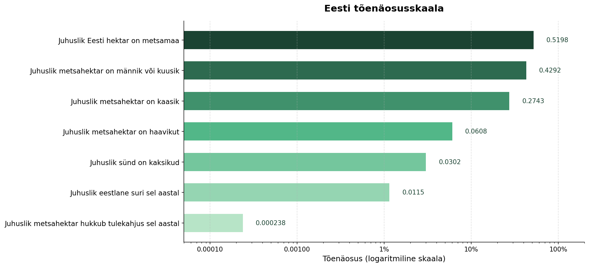

# Estonian Probability Scale

A probability scale built from Estonian open data, helping readers develop
intuition about what different probabilities actually mean in practice.



## Idea

People have good intuition about distances — centimetres, metres, kilometres.
But probabilities? Not so much. What kinds of events happen with probability 0.4?
What about 0.0002?

This project answers those questions using Estonian forest and population data,
placing everyday events on a logarithmic probability scale.

## Data sources

All data is fetched programmatically from the
[Statistics Estonia API](https://andmed.stat.ee/api/v1/et/stat):

| Table | Description |
|---|---|
| KK51.PX | Forest stock by tree species, National Forest Inventory, 1999–2024 |
| KK513.PX | Destroyed forest stands by cause and county, 1991–2024 |
| RV104.PX | Births by multiplicity (single, twins, triplets), 1922–2024 |
| RV40.PX | Deaths by month, 1927–2024 |

## Results

| Event | Probability |
|---|---|
| A random Estonian hectare is forested | 0.5198 |
| A random forest hectare is pine or spruce | 0.4292 |
| A random forest hectare is birch | 0.2743 |
| A random forest hectare is aspen | 0.0608 |
| A random birth is twins | 0.0302 |
| A random Estonian died this year | 0.0115 |
| A random forest hectare is destroyed by fire this year | 0.000238 |

## Bayesian analysis: fire risk by tree species

Conifer forest (pine + spruce) makes up **43%** of Estonian forest, but burns
roughly 3x more readily than deciduous forest, based on European fire statistics.

Applying Bayes' theorem:

| | Value |
|---|---|
| P(conifer) — prior | 42.9% |
| Relative fire risk in conifer forest | 3.0x |
| P(conifer \| fire) — posterior | 69.3% |

**Interpretation:** Although conifers make up 43% of forest, 69% of fires occur
in conifer stands. Bayes' theorem lets us flip this around — if a fire occurred
somewhere, the probability that it was in conifer forest is 69%.

## Project structure

rmk-probability-scale/
├── src/
│   ├── fetch_data.py      # API queries to Statistics Estonia
│   ├── compute_probs.py   # Probability computations
│   ├── bayes.py           # Bayesian fire risk analysis
│   └── visualize.py       # Chart generation
├── output/
│   └── probability_scale.png
├── requirements.txt
└── README.md

## Running

```bash
git clone https://github.com/sifux5/rmk-probability-scale
cd rmk-probability-scale
python3 -m venv venv
source venv/bin/activate
pip install -r requirements.txt
python3 src/visualize.py   # generates output/probability_scale.png
python3 src/bayes.py       # prints Bayesian fire risk analysis
```

## License

MIT